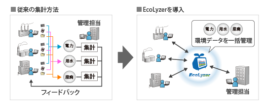
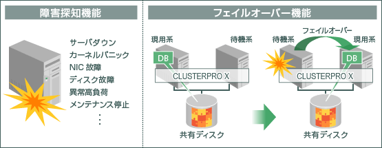

# ネットワークとは？

複数のコンピューターを接続して、相互に通信できるようにした状態。
通信回路やケーブルなどを通してコンピューター同士を接続することで
情報の共有や処理の分散、メッセージの交換などが可能になる。
ネットワークには、
同じ場所にある数台のコンピューターを接続した小規模なLAN
離れた場所のコンピューターやネットワークを専用線や公衆回線などで接続したWAN
世界的な規模でコンピューターを接続したインターネットなど、さまざまな形態がある。

ASCII.jpデジタル用語辞典
https://kotobank.jp/word/%E3%83%8D%E3%83%83%E3%83%88%E3%83%AF%E3%83%BC%E3%82%AF-7058

## 利用する目的って？

### 資源共有

コンピューターに関わる資源をネットワークすることによって
全社の情報を引き出したりする。
これによって資源とユーザの物理的な位置に関係なく使用できるようになる

### 高信頼性

ネットワーク上の代替の資源を使用することで高信頼性を実現する。

蛇足。。。信頼性の指針は以下のようなものがあります。

| フォールトトレラント | 構成要素の一部が故障、停止などしても予備の系統に切り替えるなどして機能を保ち、正常に稼動させ続けること。 |
|:--|:--|:--|
| フェイルソフト | 機器やシステムの設計などについての考え方の一つで、事故や故障が発生した際に、問題の個所を切り離すなどして被害の拡大を防ぎ、全体を止めることなく残りの部分で運転を継続すること。 |
| フェイルセーフ | 機器やシステムの設計などについての考え方の一つで、部品の故障や破損、操作ミス、誤作動などが発生した際に、なるべく安全な状態に移行するような仕組みにしておくこと。 |

### 経済性

一個の大きなメインフレーム使うぐらいなら
複数のデータベース使ったほうが安価。

| | 1998年度 | 2002年度 | 2007年度 | 2011年度 |
|:--:|:--:|:--:|:--:|:--:|
| メインフレーム | 51% | 38% | 25% | 17% |
| UNIXサーバー | 25% | 41% | 33% | 28% |
| IAサーバー | 9% | 15% | 38% | 54% |
| 独自OSサーバー他 | 15% | 7% | 4% | 2% |
| 統計参加会社の日本への出荷金額 | 1兆4710億円 | 9867億円 | 6701億円 | 3641億円 |
| 国内の推定出荷金額(IDC Japan) |  | 7731億円[12] | 6364億円[13] | 4691億円[14] |

