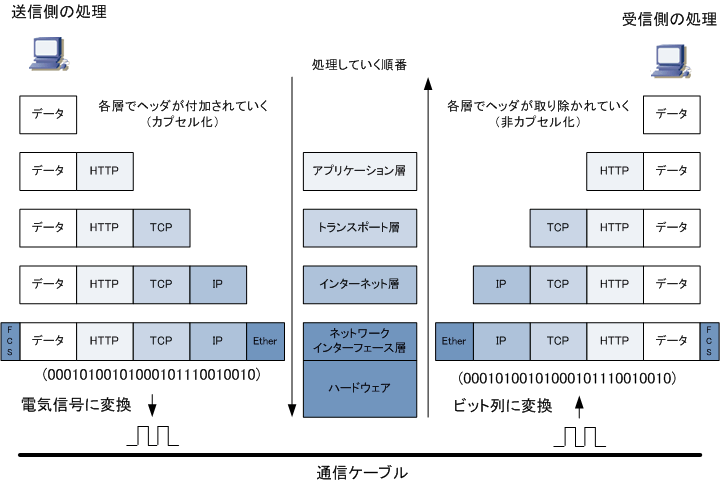
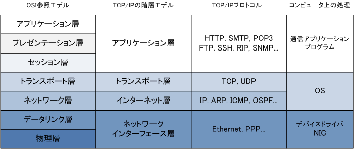

# 1-1. はじめに

## プロトコルとは？

コンピューター同士が通信をする際の手順や規約などの約束事。
ネットワークでコンピューターが使う言語のようなもので、双方が理解できる同じプロトコルを使わないと通信は成立しない。
そのため、インターネットのプロトコルの多くはRFC（Request for Comments）という形式で技術仕様が公開されており、誰でも閲覧できる。
それぞれのコンピューターは、プロトコルで定められた処理をするプログラム（プロトコルスタック）を
コンピューターに組み込むことによってネットワークに接続し、ほかのコンピューターと通信する。
たとえば、インターネットへの接続にはTCP/IPプロトコルが用いられる。
また、Webページを閲覧するためには、WebブラウザーとWebサーバーとがやり取りするためのHTTPというプロトコルが使われている。
出典｜ASCII.jpデジタル用語辞典ASCII.jpデジタル用語辞典について | 情報

## プロトコルの標準化

異なるメーカーの製品同士でも互換性をもって利用できるような規格を作り上げること。
昔は各社独自のネットワークアーキテクチャを発表し、
プロトコルを体系化していたようで、異なるメーカーのコンピュータ間で自由に通信できなかったんですね。

## プロトコルの階層化

ネットワークプロトコルは複雑になりがち

↓

機能を分割して単純化するために、通信に必要な機能を7つの階層に分けた

↓

それがOSI参照モデル。

OSI参照モデルでは、各層で何をするかという役割を定義しています。

## OSI参照モデル

### 各層の役割

#### 第７層　アプリケーション層
各アプリケーション（メールやWWWブラウザなど）に合わせて通信を行えるように定めている部分です。
最上位層に位置するアプリケーション層はユーザが直接接する部分で、コンピュータなどが通信相手を識別しネットワーク経由で送受信を行うものです。
簡単に言うとPCで動作しているソフトを思い浮かべればわかりやすいでしょうか。

#### 第６層　プレゼンテーション層
第６層のプレゼンテーション層では、上位層であるアプリケーション層にデータを提供するために情報の符号化や変換を行います。ASCIIコードやEBCDIC
コードに変換して文字として読み取れるようにします。
その他、画像フォーマットでJPEGやPICT、動画フォーマットでMPEGなどを表現するのがこの第６層になります。

#### 第５層　セッション層
第５層のセッション層では、その名の通り通信の開始から終了までの手順を決める層です。
送信元が実際にデータを送る前に「これから送りますよぉ」と相手に伝えることで通信を始めることを知らせます。
アプリケーション間で論理的な通信路（コネクション）を確立し、通信ができる状態にします。
WindowsやSQLなどがこの層にあたります。

#### 第４層　トランスポート層
第４層であるトランスポート層では、ノード間のプロセスの健全性の確保を行います。
そのために通信が正常に相手に届いたかの確認やエラーのチェックなどを行い、エラーが発生した場合は再送や回復処理、フロー制御などを行ないます。
このように書くと難しいかもしれませんが、簡単に言うと通信をする相手にデータを確実に送る役割をここでしています。

#### 第３層　ネットワーク層
第３層であるネットワーク層では、データリンク層以下のプロトコルを利用し、送信元から宛先へ到達するためのネットワークの経路を定義しています。
ネットワーク層で使用されるプロトコルで有名なのがIPとよばれるプロトコルです。様々なアクセス方式を使用していたデータリンク層同士の通信を可能にするのがネットワーク層です。

#### 第２層 データリンク層
第２層であるデータリンク層では、物理層での0,1のビット列をフレームというデータの固まりに分割し上位層に伝える働きをします。
おもに送信元及び宛先の物理アドレスや送信制御、フロー制御を定義しています。

#### 第１層
第1層である物理層では、メディアタイプ、コネクタタイプ、シグナリングタイプを定義します。
ケーブルの材質やコネクタの形状、ビット列と電気信号の相互変換といった方式を定めています。

このうち７層、６層、５層を合わせて上位層と呼んだりします。
同様に下４層を合わせて下位層と呼びます。

## TCP/IP

TCP/IP（Transmission Control Protocol/Internet Protocol）は、現在のインターネット通信および
イントラネット通信において最も利用されている通信プロトコルです。TCP/IPは複数のプロトコルから
なりますが、中心的な役割を果たすのがTCPとIPであることから TCP/IP と呼ばれるようになりました。
※　IP通信で使用するプロトコル群（ IP, ICMP, TCP, UDP, HTTP, SMTP, SSH,TELNETなど）を総称してTCP/IPと呼びます。

TCP/IPにおける階層モデルは4階層から構成されています。アプリケーション層、トランスポート層、
インターネット層、ネットワークインターフェース層の4つです。ネットワークインターフェース層は
単にネットワークアクセス層とも呼ばれています。OSI参照モデルとTCP/IP階層モデルの対応は以下。

# 1-2. 講義

http://ocw.u-tokyo.ac.jp/lecture_679/

# 1-3. Advance

実際に見てみましょう
WireShark
http://forest.watch.impress.co.jp/library/software/wireshark/

# 時間が余ったら。。。

「ネットワーク 」によって、そのビジネス構造やビジネスモデルが、大きく変革された例を3つ考えよう。